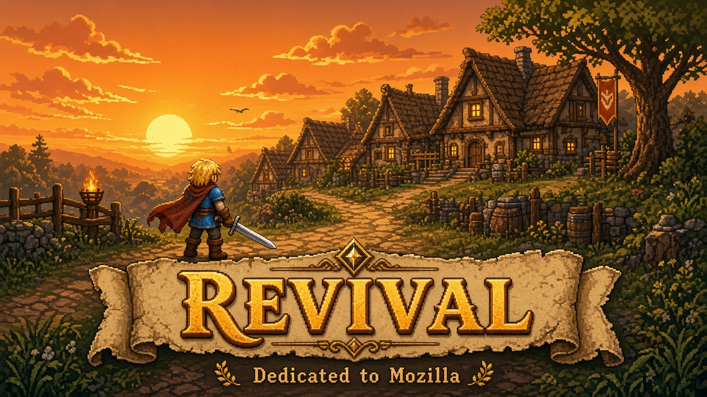
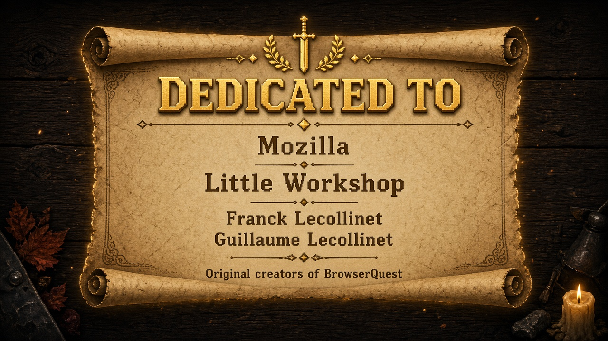

# BrowserQuest Revival

HTML5/JavaScript multiplayer adventure originally created for [Mozilla](https://www.mozilla.org/) by [Little Workshop](http://www.littleworkshop.fr/).

This repository — [AaronGrace978/BrowserQuestRevived](https://github.com/AaronGrace978/BrowserQuestRevived) — is a community revival: classic art and gameplay on modern Node.js, with optional AI NPCs, admin settings, and a custom soundtrack.



## Dedication



**BrowserQuest Revival is dedicated to Mozilla**, and to the original creators at **Little Workshop**:

- [Guillaume Lecollinet](http://twitter.com/glecollinet) — pixels / art  
- [Franck Lecollinet](http://twitter.com/whatthefranck) — code  

With gratitude for the open-web experiment that started it all. Original project: [mozilla/BrowserQuest](https://github.com/mozilla/BrowserQuest).

### Original music credits

[Gyrowolf](http://soundcloud.com/gyrowolf/sets/gyrowolfs-rpg-maker-music-pack/), [Dayjo](http://blog.dayjo.org/?p=335), [Freakified](http://soundcloud.com/freakified/what-dangers-await-campus-map), & [Camoshark](http://www.newgrounds.com/audio/listen/349734)

## Requirements

- [Node.js](https://nodejs.org/) **20+**

## Quick start

```bash
npm install
npm start
```

Then open **http://localhost:8000** in your browser.

Create a character, walk around, fight, and loot. Open a second tab (or another browser) to play together on the same local server.

Click NPCs to talk. With AI disabled, you get the classic scripted lines. With AI enabled, NPCs reply via your configured model. Target an NPC and press Enter to chat with them in conversation mode.

Music crossfades quietly between zones; combat tracks swell in for rats/bats/goblins (and friends), then a short victory sting returns you to the zone theme.

### Health check

```text
GET http://localhost:8000/status
```

Returns a JSON array of player counts per world instance.

## Configuration

`npm start` auto-creates local config files from the `*-dist` templates when they are missing:

| File | Purpose |
|------|---------|
| `client/config/config_local.json` | Dev WebSocket host/port (default `localhost:8000`) |
| `client/config/config_build.json` | Build-time host/port (seeded for local play) |
| `server/config_local.json` | Server worlds, port, map path, AI settings (merged over `server/config.json`) |
| `server/ai-secrets.json` | API keys + admin token (gitignored; created by admin UI) |

Edit those files to change ports or world capacity. Server defaults live in `server/config.json`.

## AI admin settings (recommended)

Open **http://localhost:8000/admin** (also linked as **Settings** in the game footer).

- **Localhost** (`127.0.0.1` / `::1`): open without a token
- **Remote**: set `ADMIN_TOKEN` (env or admin form), then unlock the page with that token (stored in `sessionStorage` for API calls only)

On the admin page you can:

- Enable/disable AI NPC dialogue
- Pick provider: OpenAI, Anthropic, Ollama Cloud, or local Ollama
- Set model id (free text + optional model list refresh)
- Enter API keys (never returned to the browser; blank fields leave existing keys unchanged)
- Save without restarting the server (hot-reload)

Keys are written to `server/ai-secrets.json`. Non-secret AI options are written to `server/config_local.json`. The normal game client never receives API keys.

### Environment variables (optional override)

| Variable | Meaning |
|----------|---------|
| `AI_ENABLED` | `true` / `1` to enable |
| `AI_PROVIDER` | `openai`, `anthropic`, `ollama-cloud`, or `ollama` (local) |
| `AI_MODEL` | Any model id from that provider |
| `OPENAI_API_KEY` | OpenAI |
| `ANTHROPIC_API_KEY` | Anthropic |
| `OLLAMA_API_KEY` | Ollama Cloud (and optional for local) |
| `OLLAMA_BASE_URL` | Local Ollama base URL (default `http://127.0.0.1:11434`) |
| `OLLAMA_CLOUD_BASE_URL` | Ollama Cloud base URL (default `https://ollama.com`) |
| `AI_TIMEOUT_MS` | Request timeout (default `12000`) |
| `ADMIN_TOKEN` | Token required for non-localhost admin access |

Env vars apply on process start. After you save from `/admin`, the live server uses the saved settings until restart.

Per-NPC personality scripts live in `server/js/ai/npc-scripts.json`.

## Project layout

- `client/` — browser game (RequireJS, canvas, assets)
- `admin/` — AI settings UI (server-protected APIs)
- `server/` — Node game server
- `server/js/ai/` — AI router and providers
- `shared/` — shared message/entity types (`gametypes.js`)
- `scripts/ensure-config.js` — seeds local config on start

## Production client build (optional)

The classic RequireJS optimizer build still lives under `bin/`. For day-to-day play it is not required; the server serves `client/` directly.

## License

Code: MPL 2.0. Content: CC-BY-SA 3.0. See `LICENSE`.

## Credits

Created by Little Workshop for Mozilla:

- Franck Lecollinet — [@whatthefranck](http://twitter.com/whatthefranck)
- Guillaume Lecollinet — [@glecollinet](http://twitter.com/glecollinet)

Revival maintained at [AaronGrace978/BrowserQuestRevived](https://github.com/AaronGrace978/BrowserQuestRevived).
